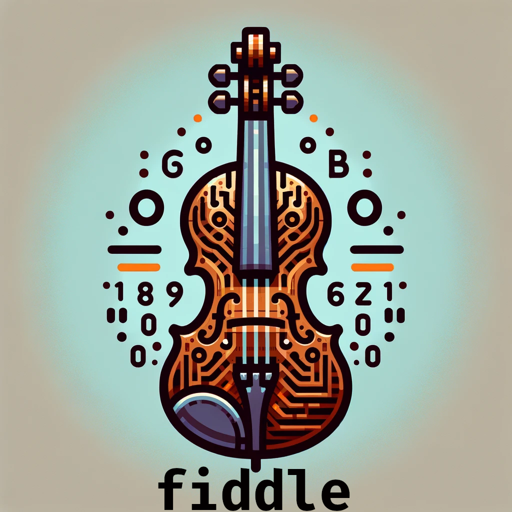

# Fiddle



> Fiddle é produto do meu tédio e um trabalho em progresso. Eu não vou manter o README atualizado no momento, porque eu to correndo atrás das features, e como está muito na infância, o branch main é onde se desenvolve também. Fiddle no momento é só um programa besta em OCaml pra pegar números que sejam possíveis CPFs, calcular os dígitos verificadores corretos, e calcular o hash do CPF. Como se fosse uma Rainbow Table de CPFs. Não é exatamente útil. 

### Ajustes e melhorias

O projeto ainda está em desenvolvimento:

- [x] Gerar dígitos verificadores.
- [x] Fazer o hash, e jogá-lo pra stdout.
- [x] Criar interface cli, ao invés de apenas receber stdin.
- [x] Opção de algoritmo de hash e comprimento.
- [x] Opção de hash chaveado ou MAC, via variável de ambiente `FIDDLE_SECRET_KEY`
- [x] Busca reversa, a partir de um hash, encontre um CPF.
- [ ] Verificar se a entrada já está com os dígitos verificadores.
- [ ] Mask processor, com a capacidade de ditar qual formato o CPF se encontra `xxx.xxx.xxx-xx`, `xxxxxxxxx-xx` ou `xxxxxxxxxxx`
- [ ] Suportar busca através de hash table pré-computadas????

## 💻 Pré-requisitos

Antes de começar, verifique se você atendeu aos seguintes requisitos:

- `opam 5.2.0 / Cryptokit / Core / Core_unix`

## 🚀 Compilando Fiddle

Para rodar o Fiddle, siga estas etapas:

```
dune build 
```

Eu ainda tenho que escrever a funcionalidade de instalação

## 🎻 Usando Fiddle

Para usar Fiddle, siga estas etapas:

Teste123:
```
$ echo 123456789 | fiddle
```
O resultado deve ser:

```
123456789-09	65ffb63cf915bb8919d61837aa335bb39f4e07065e772b326bfb8de79d60745e
```

Fiddle pode processar mais de um CPF

```
$ echo "123456789\n987654321" | fiddle
```
ou

```
$ echo "123456789 987654321" | tr " " "\n" | fiddle
```

O importante é cada valor ser separado por `newline`. O que quer dizer que você pode mandar um

```
$ seq 10000 | fiddle
```

Você pode listar os algoritmos de hash e mac disponíveis via:

```
$ fiddle --list
```

E selecionar o que deseja com `-h` ou `--hash`

```
$ echo 123456789 | fiddle -h sha512
```

Alguns algoritmos necessitam que se especifique o tamanho da saída:

```
$ echo 123456789 | fiddle --hash blake2b --length 64
```

Para utilizar hash chaveado ou mac é necessário que variável de ambiente `FIDDLE_SECRET_KEY` contenha com uma chave secreta em base64. Um algoritmo tem de ser selecionado com a flag `-m` ou `--mac`:

```
$ export FIDDLE_SECRET_KEY="DmPBlJkhjvN0HxCKK9HrsiFLzIotZG9MT727xddLIzw="
$ echo 123456789 | fiddle --mac sha256
```

Tem também busca reversa, que pode ser acionada via a flag `-u` que é a inicial de ughh, ou de unhash:

```
fiddle -h md5 -u 823e99bf5f87df225fe8ce4c46340b73
```

Que vai resultar em: `000000003-53`


Também tem paralelismo taco bell, mas não tá funcionando direito no momento:

```
$ seq 200 | xargs -L 25 -P 8 fiddle
```


## 📝 Licença

Esse projeto está sob licença. Veja o arquivo [LICENÇA](LICENSE.md) para mais detalhes.
